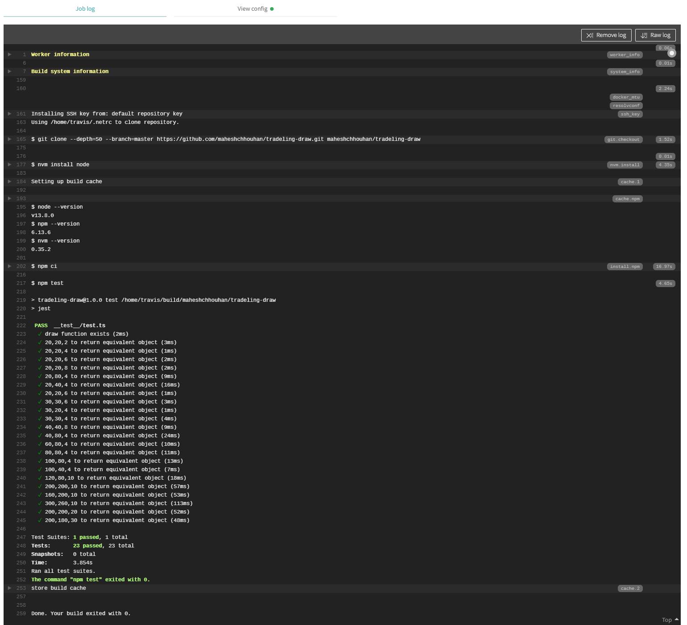
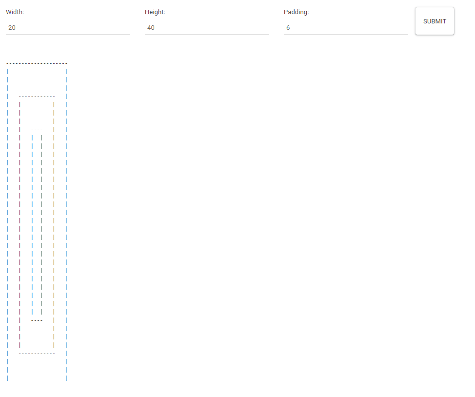
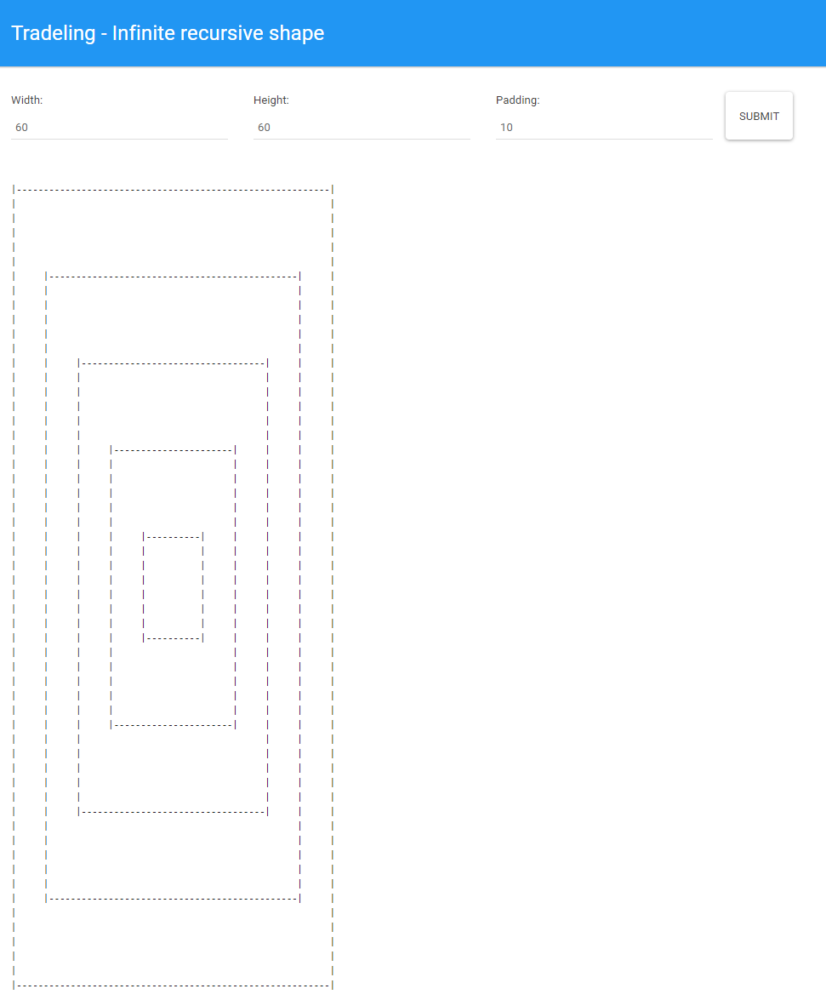
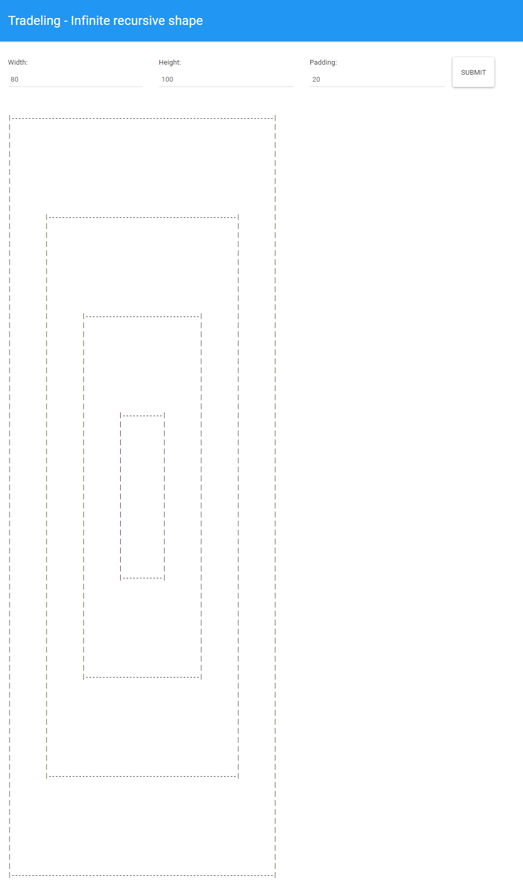

# tradeling-draw

Infinite recursive shape: To create a recursive function to draw boxes inside each other in array on the basis of 3 parameters
`width` `height` and `padding` 

## Built With

* [NextJS with Typescript](https://nextjs.org/learn/excel/typescript) 
* [Jest](https://jestjs.io/)

### Installing &  Running
`cd tradeling-draw && npm i && npm run dev`
  
## Testing
I am using jest to write unit tests inside `__tests__` folder and using `test_data.json` file to loop through and validate object return from draw function is equivalent to test data object

`npm run test`

## Draw Recursive Fn

Base Case: If width or height is less than or equal to zero then return empty []

1. If height is less than 2 then draw the last row
2. if the width and height less or equal padding + 2 then draw inner box
3. Returning array by calling draw function recursively by subtracting padding by 2 to handle the edges of inner arrays

you can see more details inside `helpers/index.tsx` file.

### Big O 
O(n^2) - Quadratic

## Travis

## Deployed on Now

* [Tradeling - Infinite Recursive Shape](https://tradeling-draw.now.sh/)

### Screen shots 

1.  `Width: 20, Height:40, padding: 6)`

2.  `(Width: 60, Height:60, padding: 10)`

3.  `(Width: 80, Height:100, padding: 20)`

